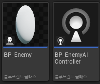
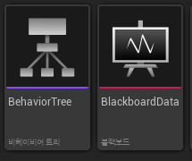
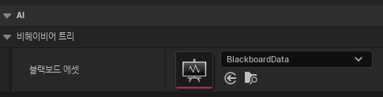
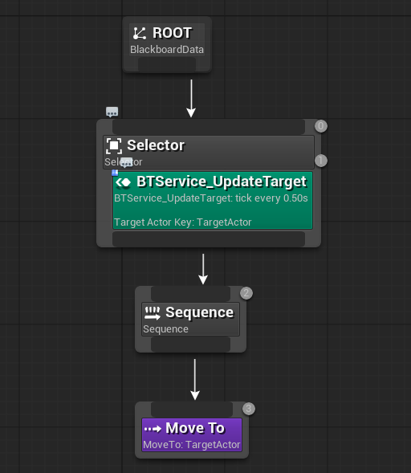
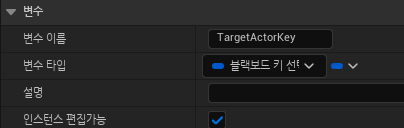
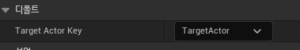
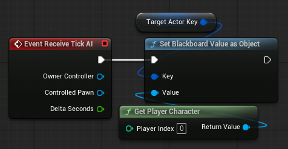
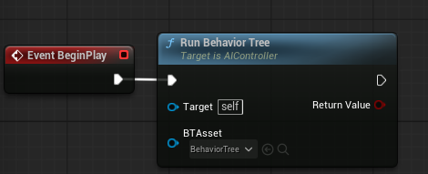

Nav Mesh Bounds Volume 액터를 배치해 적들이 돌아다닐 영역을 지정한다.

적들의 AI 로직과 자체 기능을 분리하기 위해 블루프린트를 두개로 나누었다.

BP_Enemy는 자신이 어떤 AI 로직을 따라야 할지 알아야 하므로 AIController에 BP_EnemyAIController로 지정한다.
적이 월드에 배치되거나 생성된 순간 AIContoller가 자동으로 작동하게 해주기 위해 Auto Possess AI의 값을 Placed in World or Spawned로 할당한다.

적의 AI가 판단할 때 사용할 공우 데이터 저장소인 BlackBoard와 어떻게 행동할지 알려줄 Behavior Tree를 생성한다.

AI가 행동할 기준인 TargetActor 변수를 생성하고 플레이어뿐만 아니라 다른 액터들을 대상으로도 사용할 수 있게 Base Class를 Actor로 지정했다.

Behavoir Tree는 어떤 행동을 할지만 알고 있고 행동할 기준이 되는 데이터는 모르기 때문에 BlackBoard와 연결시킨다.

MoveTo 테스크를 시퀀스에 연결하고 Blackboard Key를 TargetActor로 지정해 AI가 네브메쉬 경로를 따라 자동으로 이동하게 한다.

적이 플레이어를 처음에는 찾을 수 있지만 게임이 진행되며 플레이어의 상태가 변경되면 AI가 플레이어를 다시 확인해야 한다.
그렇기에 0.5초마다 플레이어를 재차 확인하는 BTService_UpdateTarget이라는 서비스를 하나 만들어 그 안에 BlackBoard Key Select Controller타입의 BlackBTargetActorKey라는 변수를 선언하고 Bahavior Tree의 인스펙터에서 기본값을 블랙보드에서 만든 tarhetAcotr로 할당한다.
GetPlayer를 통해 레벨의 플레이어를 가져온 후 TarggetActor 변수 안에 값을 넣는다.

BP_EnemyAIController가 따를 Behavor Tree를 BeginPlay에서 지정한다.

