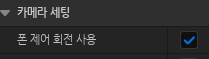

IA_Look 생성
Aixs 2D로 설정

X = 마우스 좌우 움직임
Y = 마우스 위아래 움직임
마우스를 위로 올렸을 때 화면이 위로 올라가고, 아래로 내렸을 때 내려가게 하기 위해 Action Value Y에 -1을 곱해 방향 전환함.

카메라가 벽에 파묻히는 걸 방지하기 위해 SpringArm 컴포넌트의 자식으로 카메라를 두었다.
3인칭에서 플레이어와 카메라의 거리,각도는 수동으로 조절했다.

SpringArm의 Use Pawn Control Rotation을 켜서 SpringArm이 캐릭터 컨트롤러의 회전을 따라가게 했다.
반대로 카메라의 Use Pawn Control Rotation은 껐는데, 카메라는 일정 거리를 두고 플레이어를 계속 바라봐야 하지, 자체적으로 회전을 하면 안 되기 때문이다.

케릭터가 회전 방향으로 몸체를 돌게 하기 위해 Orient Rotation to Movement를 켰다.

