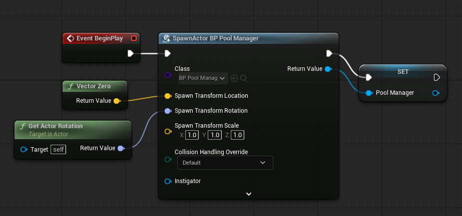
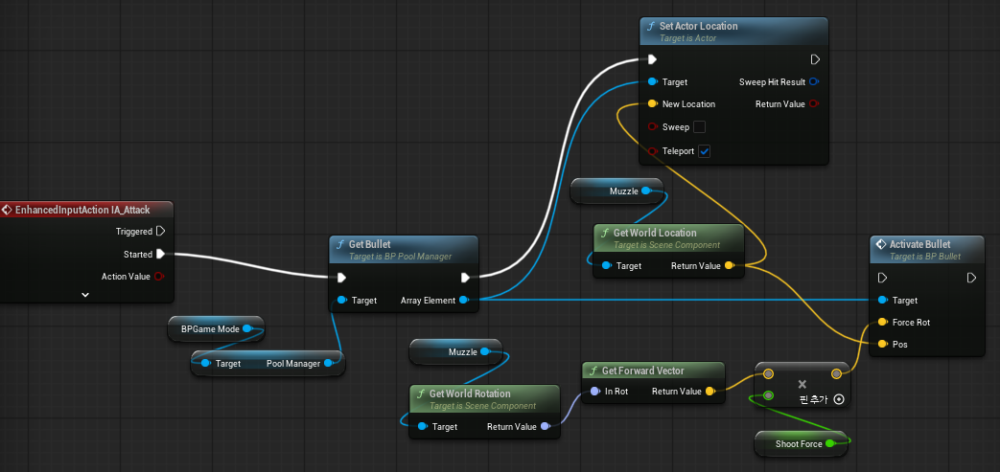
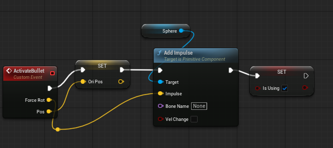
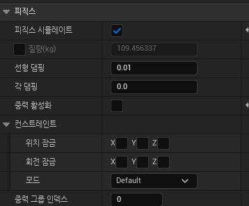

오브젝트 풀링 방식을 사용해서 매번 생성과 파괴를 반복하는 일을 없게 할 것이다.
풀오브젝트들을 관리할 GameMode에서 접근이 가능하게 할 PoolManager의 경우, Actor 기반으로 만들었다.
UObject라는 선택지도 존재했지만 블루프린트에서 만들기 상대적으로 어렵고, 번거롭고 복잡한 과정들이 많아 Actor기반을 택했다.

먼저 BP_Bullet 클래스를 참조해 정해진 수량만큼 탄환들을 생성 후, BP_Bullet 오브젝트 레퍼런스 배열에 저장했다.

다른 곳에서 탄환을 가져갈 수 있게 GetObject 함수를 만들었다.
배열을 처음부터 끝까지 검사하며. 만약 탄환이 사용 중이지 않을 경우 해당 탄환을 반환한다.

PoolManager는 총알을 관리하고 빌려주고 플레이어는 실제 발사 로직을 담당하는 거로 역할을 분리하기 위해, 총알의 위치와 회전값은 플레이어가 설정하게 했다.
플레이어의 위치에서 탄환을 바로 발사하면 탄환이 플레이어에 닿을 수 있기에, Muzzle(총구)를 추가해 그것을 기준으로 값을 설정하게 했다.
BP_Player는 총구의 회전값의 앞 벡터에 Force를 곱해 BP_Bullet에게 넘겨준다.

탄환은 활성화된 직후, 플레이어에게서 값을 받은 값을 토대로 작동한다.
이후 로직에서 쓰기 위해 발사 위치를 저장하고, IsUsing을 True로 설정한다.
탄환은 즉각적으로 발사되는 느낌이 더 어울리기에, Add Impulse를 사용했다.

Event Tick에서 매 프레임마다 이전에 저장해둔 발사 위치와 현재 탄환의 위치를 Distance로 비교하며 일정 거리 아상 떨어졌을 시, 속도를 초기화하고 IsUsing을 다시 false로 설정한다.

Impulse를 사용하고 있기에 탄환의 Simulate Physics는 키고 탄환이 아래로 가라앉는 걸 막기 위해 Use Gravity는 껐다.

이때, PoolManager에서 게임 시작 시, 탄환이 생성된 후에 물리,콜리젼,위치를 초기화했음에도 탄환들이 Z축의 -방향으로 매우 빠르게 이동하는 현상이 발생했다
또한, 원래라면 공격 버튼을 눌렀을 때 탄환이 총구 위치로 이동하고 속도가 0으로 초기화된 다음 Add Impulse를 통해 발사돼야 하는데 플레이어 위치로 이동된 직후 플레이어가 바라보는 방향이 아닌, Z축 -방향으로 빠르게 이동하는 게 지속되었다.
탄환이 플레이어와 멀어져서 속도가 초기화되고 레벨에서 숨겨지는 거리가 1000 이상부터인데, 현재 탄환은 Z축 -방향으로 1초에 거의 2000씩 이동한다.
그렇기에 탄환을 발사한 직후 바로 이벤트 틱의 조건문에 걸리는데 이때 로그는 찍히지만, 속도는 초기화되지 않아 탄환이 계속해서 이동한다.

탄환이 처음 생성됐을 때 Z축 -방향으로 이동되는 게 초기화되지 않고 계속 지속되는 바람에 이런 현상들이 일어나는 것으로 추정된다.

